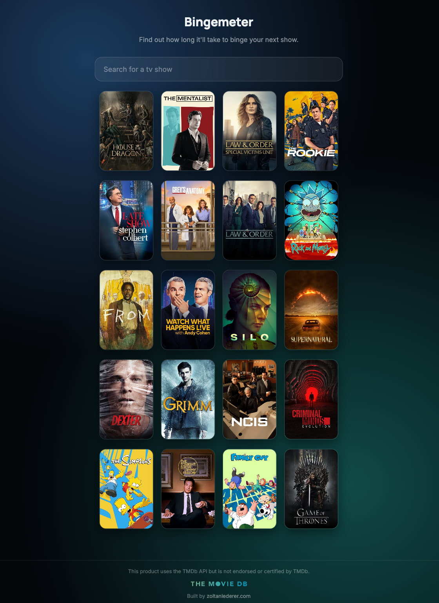
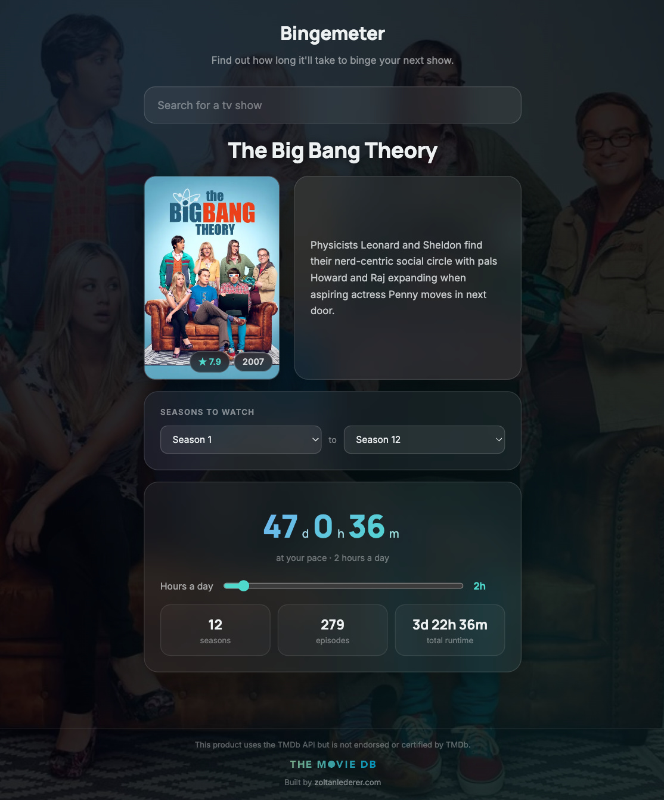
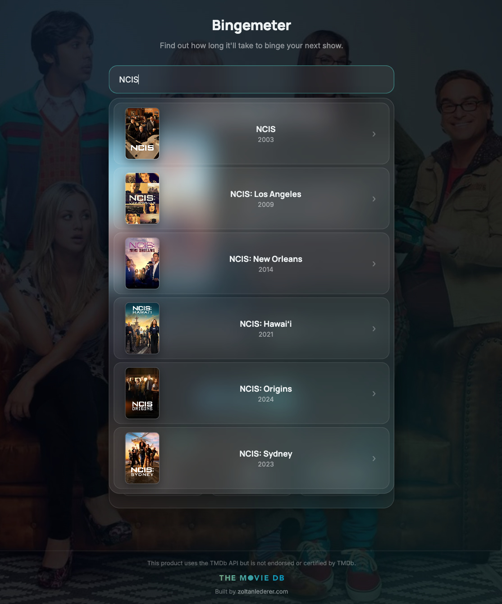

# Bingemeter

Find out how long it'll take to binge-watch your next TV show — search for a show, pick which seasons you want to watch, set your own daily pace, and see a personalized estimate of how many days it'll take.

**Live demo:** _coming soon_

## Screenshots

### Trending shows on the home screen


### Show detail with watch-time breakdown


### Live search with poster thumbnails


## Features

- **Live search** with debounced input (waits for typing to pause before calling the API, rather than firing a request on every keystroke)
- **Season range selection** — pick a "from" and "to" season, and every calculation updates to reflect only that range
- **Personalized pace calculator** — set your own hours-per-day, and see exactly how many days (and hours/minutes on the final day) it'll take at that pace
- **Total runtime breakdown** — real per-episode runtime data, summed across every episode in the selected range, not an estimate
- **Trending/popular shows** shown on the home screen so there's always something to explore
- **Full loading and error handling** — every fetch is checked for a failed response, in-flight requests are cancelled when they're no longer needed (e.g. switching shows mid-load), and failures show a clear message instead of a stuck spinner
- **Clickable poster** linking directly to the show's TMDB page

## Tech stack

- React (Vite)
- Vanilla CSS (no framework)
- [The Movie Database (TMDB) API](https://www.themoviedb.org/) for show, season, and episode data

## Running locally

```bash
git clone https://github.com/zoltanlederer/binge-watch-calculator.git
cd binge-watch-calculator
npm install
```

Create a `.env` file in the project root with a TMDB API Read Access Token:

```
VITE_TMDB_API_TOKEN=your_token_here
```

Then start the dev server:

```bash
npm run dev
```

## Attribution

This product uses the TMDb API but is not endorsed or certified by TMDb.
